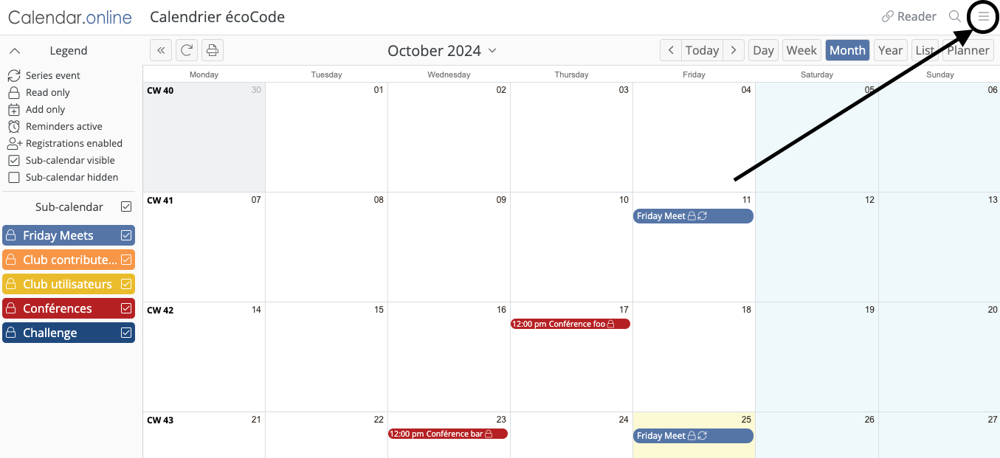
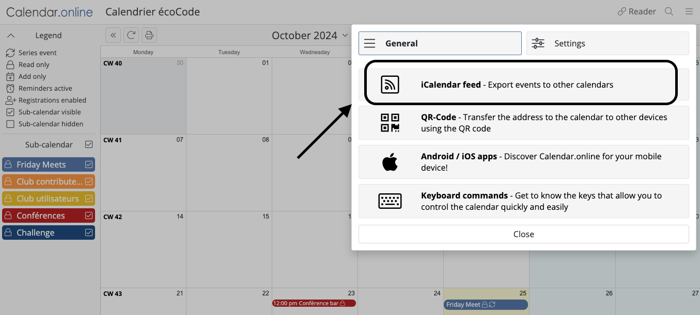
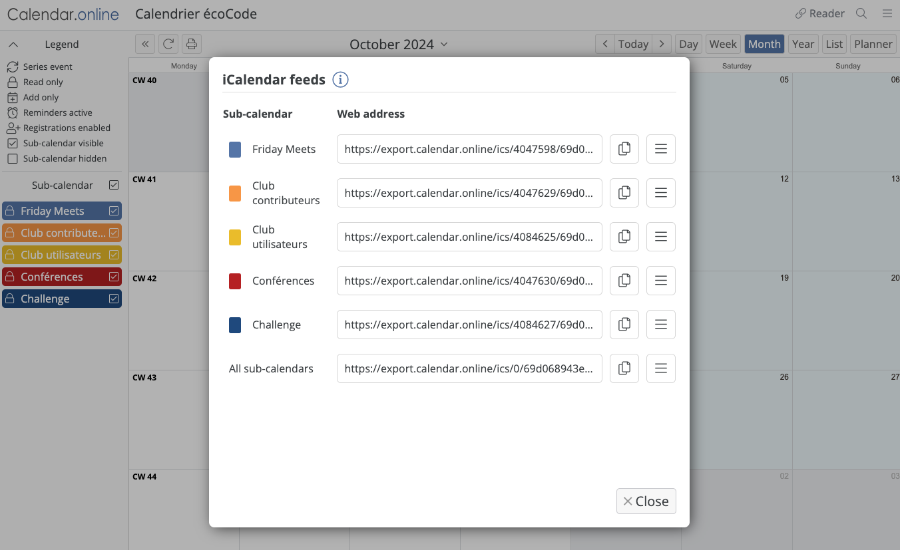

# Calendar tool 

- [Administration, editing & reading the calendar](#administration-editing-reading-the-calendar)
- [Tips for readers](#tips-for-readers)
    - [Option 1 : Subscribing to only one subcalendar](#option-1--subscribing-to-only-one-subcalendar)
    - [Option 2 : Subscribing to all subcalendars so that they appear in one calendar in your own agenda](#option-2--subscribing-to-all-subcalendars-so-that-they-appear-in-one-calendar-in-your-own-agenda)
    - [Option 2-bis : Subscribing to all subcalendars so that they appear in one calendar in your own agenda](#option-2-bis--subscribing-to-all-subcalendars-so-that-each-subcalendar-appears-independently-in-your-own-agenda)
- [Tips for editors](#tips-for-editors)
- [Tips for admins](#tips-for-admins)
- [Miscellaneous](#miscellaneous)

The tool used to plan the Green Code Initiative's meetings is [calendar.online](https://www.calendar.online).

## Administration, editing & reading the calendar

No account is necessary to admin, edit or see the calendar (and its subcalendars).

Three links were initially generated : 
1. one for admins,
1. one for editing,
1. and one for reading.

If you have the admin link, you can admin the whole calendar ! The link https://calendar.online/69d068943ef1b232261c is the read-only link.

## Tips for readers

Five sub-calendars were created :

1. Friday-meets
1. Club contributeurs
1. Club utilisateurs
1. Conférences
1. Challenge

You can copy different URLs to subscribe to iCalendar feeds.

> From the site's documentation :
> 
> Using the iCalendar feeds, you can import your events into other calendars such as Microsoft Outlook, Google Calendar, Thunderbird, or Apple iCal. Regardless of the access link, an iCalendar feed only allows read-only access.

### Option 1 : Subscribing to only one subcalendar

Just copy the URL link next to the sub-calendar you want to subscribe to and create a new calendar with it in your own agenda tool.

### Option 2 : Subscribing to all subcalendars so that they appear in one calendar in your own agenda

Copy the URL link next to the "All sub-calendars" options. When you'll create the new calendar in your agenda, all the sub-calendars will appear as one (all events under the same color scheme).

Pros : 

- faster to set up
- you can easily select and deselect all the events in one click once imported

Cons :

- you cannot cherry-pick what type of events appear in your agenda

### Option 2-bis : Subscribing to all subcalendars so that each subcalendar appears independently in your own agenda

Just repeat "Option 1" for all the sub-calendars you want.

Pros : 

- you can easily cherry-pick what type of events appears in your agenda

Cons :

- slower to setp
- you cannot easily select and deselect all the events in one click once imported

## Tips for editors

- It is a regular calendar tool so it is pretty straightforward.
- Editors have the same edition rights for events as admins but cannot edit sub-calendars.

## Tips for admins

- This is a free version so the limit is 6 sub-calendars. Other limits will apply (check out the site's documentation).
- You can easily integrate it in a website (cf. "Website" tab in the Admin dashboard).

## Miscellaneous

- It is hosted in Germany