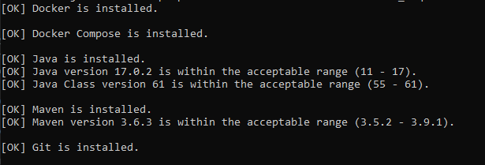

# Local environment checker tool

- [Purpose](#purpose)
- [Requirements](#requirements)
- [Files](#files)
- [How does it work ?](#how-does-it-work-)
- [Screenshots](#screenshots)

## Purpose

Tool to check local development environment.
Some requirements are mandatory (tools and versions) before beginning development on the plugin.

## Requirements

Tool was created on Mac OSx environment.
Please feel free to report any issues found.

Tested on :

- macOS : 12.6.3 / 13.1 / 13.2 / M1 pro 13.0.1
- Ubuntu : 22.04.1 LTS
- Windows : 10 Famille

## Files

For Mac OSX and Linux :

- `_core.sh` : file containing core functions used by checker tool
- `check_requirements.sh` : tool checker for Mac OS and Ubuntu

For Windows :

- `check_requirements.bat` : tool checker for Windows
- `install_jq.bat` : script to install easily `jq` for Windows with `winget`

Common files:

- `config.txt` : file containing the configuration of checker tool (tools, versions, debug)

## How does it work?

- [OPTIONAL] change the configuration in `config.txt` file
- [OPTIONAL] launch `install_jq.bat` if you need to install `jq` for Windows

For Mac OSX and Linux :

- launch `check_requirements.sh` to check the local environment

For Windows :

- launch `check_requirements.bat` to check the local environment

## Screenshots

For Mac OSX and Linux :

For Windows :

