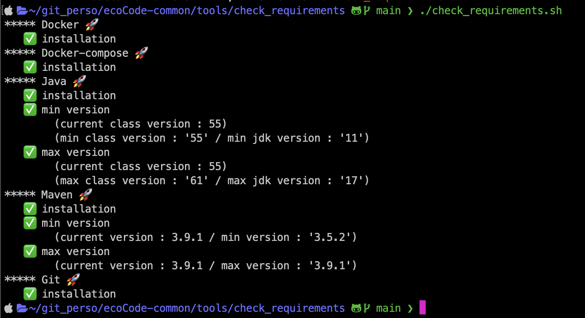

# Local environment checker tool

- [Purpose](#purpose)
- [Requirements](#requirements)
- [Files](#files)
- [How does it work ?](#how-does-it-work-)
- [Screenshot](#screenshot)

## Purpose

Tool to check local development environment.
Some requirements are mandatories (tools and versions) before beginning development on plugin.

## Requirements

Tool was created on Mac OSx environment.
Please feel free to report issues if found.

Tested on :

- macOS : 12.6.3 / 13.1 / 13.2 / M1 pro 13.0.1
- Ubuntu : 22.04.1 LTS
- Windows : 10 Famille

## Files

For Mac OSX and Linux :

- `_config.sh` : file containing the configuration of checker tool (tools, versions, debug)
- `_core.sh` : file containing core functions used by checker tool
- `check_requirements.sh` : tool checker for Mac OS and Ubuntu
- `check_requirements.bat` : tool checker for Windows OS

## How does it work ?

For Mac OSX and Linux :

- [OPTIONAL] change configuration in `_config.sh` file
- launch `check_requirements.sh` to control local environment

For Windows :

- launch `check_requirements.bat` to control local environment
- check verions displayed to check if requirements on versions are respected

## Screenshot

